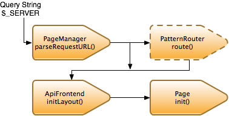
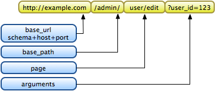

# Core > Routing

## What Is Routing?

Routing is the process by which Agile Toolkit determines which code to run in response to a request.

Requests are passed to the webserver from the browser in the form of a URL. Each URL should define a unique resource for your app to return to the requester. It is considered a proper design if URL alone can fully determine user's desired action - avoid storing some routing logic in Session data or POST data. Here is a typical URL:

    http://example.org/admin/user/edit?user_id=132

Routing in Agile Toolkit is a simple yet sophisticated method and can be easily adopted to handle URLs like this:

    http://en.example.com/about.me
    http://johndoe.mysites.com/
    http://listings.com/houses/riverside-lake-3-bedroom/apointments/6545/edit

Agile Toolkit will parse your URL on request and connect it to the proper code. It will also generate URLs for you. Select sub-topic or continue reading for introduction.

 * [Interpretation and parsing of URLs](routing/parsing.md)
 * [Generating URLs and redirecting, relative URLs](routing/url.md)
 * [Sticky GET arguments](routing/sticky.md)
 * [URLs to your assets: images, css, js](routing/assets.md)
 * [Using PatternRouter for SEF (search engine friendly) routing](routing/patternrouter.md)
 
## Introduction to Routing

Agile Toolkit is following Model View Presenter. Presenter contains presentation logic. To keep things simple we call it "Page". In other words, "Page" object is responsible of initializing all other elements you have on your page. 

*Routing is the process which determines which Page class should be loaded and used.* 

 1. PageManager is a standard class designed to break down your URL into essential components (explained below in more details)
 1. PatternRouter is an **optional** step which can convert "beautiful" or SEF URLS into normal form.
 1. Application routes **page** to a class or a method
 1. Page object continues to initialize objects.
 
### Essential parts of every URL

All request to Agile Toolkit must be translated into four essential parts as displayed on the graph to the right.

If the URL is search-engine friendly and some arguments are hidden in the "page" part, they need to be extracted by PatternRouter. Note that you may use `Controller_PatternRouter` or you may write your own extraction logic, but this transformation must take place inside your `Application::init()`.

You should also note how slashes are distributed. `base_url` has no training slash, while `base_path` always begins and ends with a slash.

### .htaccess

It does not matter how exactly you route your request - as long as it reaches the Application class (which is typically through index.php), that should be acceptable. Below is a sample `.htaccess` file which you can use in your installations:

    RewriteEngine On
    RewriteRule ^[^\.]*$            index.php   [L]

If you are running NGINX, here is sample configuration:

    location ~ ^[^.]*$ {
      include /etc/nginx/fastcgi_params;      ##Includes our fastcgi setup
      fastcgi_param SCRIPT_NAME     "/index.php";
      fastcgi_param SCRIPT_FILENAME "/www/path/admin/index.php";      
    }

# Advanced Topics: TO BE REMOVED
# Advanced Topics: TO BE REMOVED below

     
## Securing Installation

Fundamentally Agile Toolkit comes with several concepts which should make it safe to have Agile Toolkit and your application to stay completely inside web-root.

 - All PHP files contain only a class definition
 - All Sensitive configuration stored declaratively inside config.php
 - Locations containing data which shouldn't be accessible secured with .htaccess files

A simple drop-inside-webroot approach is provided to simplify your first installation time. For a production installation you must consider moving your project files outside of your webroot. This can be done by following installation instructions at http://github.com/atk4/atk4 or --- link to tutorial.

Secure installation is completely transparent and does not require you to change your software code. The same project can be installed in different configurations through git, so you don't need to keep your application secure on your local laptop if you plan to install it securely on the server.

## Handling the Request

So far we have looked at the way how URL is converted into `page` and `_GET arguments`. Let's talk about what the toolkit is doing with this information.

### 1. Look for method in Application class

Agile Toolkit typically uses camel case for naming methods. There are some exceptions where some specific methods needs to be distinguished. In this case application methods starting with `page_` can be executed from the web directly.

    function page_about($p){
        $p->add('LoremIpsum');
    }

The above method in your application will add support for "about" page. Method receives instance of a Page class, where you can add additional objects.

### 2. Look for custom page class

If method is not found in the Application class, the attempt is made to load a custom page class. Page classes are the only objects in Agile Toolkit which can be directly addressed from web, therefore all pages start with `page_` and reside in a separate folder `page/`. 

<.. i have this info on the web, we can reuse old docs ..>

### 3. Loading static pages

### 4. Executing $api->pageNotFound()

### Routing pages to add-ons.

Agile Toolkit makes it possible for some pages to be handled by add-on. For example if you are using OAuth add-on, it redirects 'auth' page (and it's sub-pages) towards the classes inside add-on's namespace. 

Here is the example scenario

 - page: "test/abc"
 - code in api: $this->api->routePages('auth','example/myaddon');
 - page class: example\myaddon\test_abc
 - page location: addons/example/myaddon/page/test/abc.php

