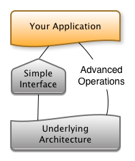
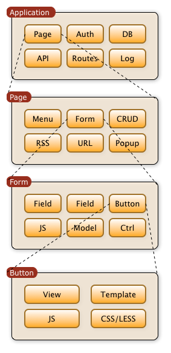
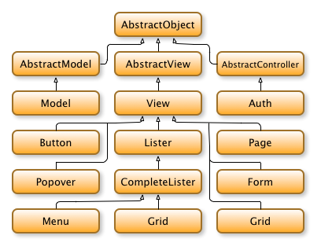

# Design Goals

Agile Toolkit does not inherit patterns from other web frameworks. Instead it takes a fresh look at Web Development and applies some principles from desktop frameworks.

You'll find Agile Toolkit easier to learn if you understand our fundamental principles first. Your knowledge of other web frameworks might hold you back or prevent you from understanding Agile Toolkit - it's advisable that you temporarily (or permanently) forget those.

The key principles to Agile Toolkit are:

* Simple - Make things simpler
* Advanced - Go advanced without refactoring
* Compose - Build anything out of smaller components
* Inherit - Use Object Oriented Programming extensively
* Agile - Be Agile Methodology-friendly

## Make Things Simpler

Step 1: Download and [Install](../install.md) Agile Toolkit.

Step 2: In page/index.php add:

Step 3: Click "Preview / Publish" to install your Web App into the cloud.

Agile Toolkit makes web development simple. It's more simple then using NO frameworks at all. Our focus is to make complex processes simple and accessible. We also focus on etiquette of the code, to make your source code look concise and readable.

**Agile Toolkit will always offer you a simple way to get things done.**

* User Interface Creation - make a form/field/widget with one line
* User Interface Theming - change look and feel easily
* 3rd party Add-ons - install in one click
* Deploy to the cloud in few clicks (free hosting service)
* Database access - perform database operation in one line
* Routing - define pretty URL in one line
* User Authentication - check user access with one line
* Data Sources - switch between MySQL, Mongo, MemCache easily
* Test Scripts - create test scripts with few lines of code
* Relational SQL - use joins, expressions and sub-queries without headache
* Performance - optimize your application for scalability
* JavaScript - import 3rd party jQuery plugins with one line of code
* AgileToolkit.org - get community help in one place
* Commercial - priority support one click away

## Go Advanced

Simplicity might get your application working in a record time, but just as important is the ability to customize, tweak and provide long-term support. Access to more advanced features is equally important.

**Agile Toolkit will never sacrifice access to advanced functionality, should you need it.**

* Create your own widgets - write your own HTML
* Add your custom CSS rules on top of the theme
* Use Composer to customize add-on installation
* Deploy to a custom / your own server (commercial feature)
* Execute complex queries and vendor-specific database code
* Implement your own routing controller
* Customize authentication mechanism or use 3rd party auth
* Use your own SQL queries, access Mongo's collection object
* Run automated tests from scripts
* Write your own JavaScript library and use it anywhere

## Build out of Blocks

Composition means creating a new object out of other objects like building blocks. Unlike giving you a one-fits-all solution, you'll have a lot of smaller components and with knowledge will be able to build unimaginable solutions yourself.

### Composing UI

The Toolkit uses this principle very strongly in user interface. Chunks of user interface can be combined out of smaller components to build more complex interfaces. Page consist of Views such as Form, CRUD or Menu. Each of those Views can combine more Views recursively and/or rely on HTML/JADE templates.

### Composing Model Layer

Data management also use composition. You can use modules to enhance the functionality of your Models. The basic implementation tries to minimize functionality but you can add controllers for soft delete, audit, disjoint subtypes, access control, nested data, recursive models and caching.

### Composing Application

Application itself consist of blocks. For example - your application will not have any authentication unless you add Auth controller. There are many other controllers to provide functionality you might expect from a framework.

We make sure that there is a wide selection of 3rd party components which you can use and combine together. Unlike other software solutions, add-ons give you many components and blocks you can re-use.

It is also important to note that ANY object may contain blocks even if it's not designed for it. Knowing that you can attempt to insert Button inside Field or Search field inside Menu with great success.

## Object Oriented Programming

Often neglected in Web but consistently present in Desktop Frameworks - inheritance is strong with Agile Toolkit.

All the classes defined in Agile Toolkit are "open", methods are easy to re-define and override. The method names and arguments are preserved consistent throughout the releases giving your application required level of stability and a huge benefit of extensibility.

The use of Object Oriented Pattern gives immense amount of utility for every single object:

* to have children, where each is assigned unique name;
* to support hooks, dynamic methods and simplified exceptions;
* to support object destruction, session access, debug and warning facility;
* AbstractView introduces "rendering" and templates;
* AbstractView introduces JS event binding.

Most of 3rd party code developed for Agile Toolkit will inherit base classes and will preserve all of the essential utility without no overheads. Yet this allows you as a developer not only use add-on as a whole, but use its models, views and other classes anywhere in your code.

## Agile Methodology

If you are fond of Agile Methodology for software development, you'll find that Agile Toolkit meets your coding style perfectly. There are several patterns enforced by a framework itself which makes your developers even more efficient:

* Make your prototype quick, then tweak;
* Separate Templates from Presentation Code and Business Code;
* Minimum impact of refactoring - know exactly what areas are affected;
* Generic Views - interface without bugs;
* Working in teams - code consistently and safe;
* Developers make mistakes - anticipate and prevent.

### Agile Toolkit on testing

* Modular testing - add your widgets on a separate test-pages for rendering/UI regression testing
* Integrated Visual testing environment designed to reduce time necessary to write test scripts and make them more useful
* Performance and memory impact testing
* Visual and Scripted tests
