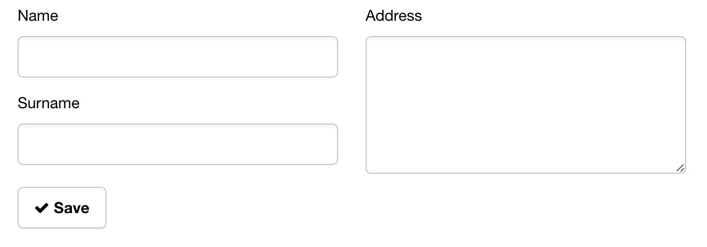
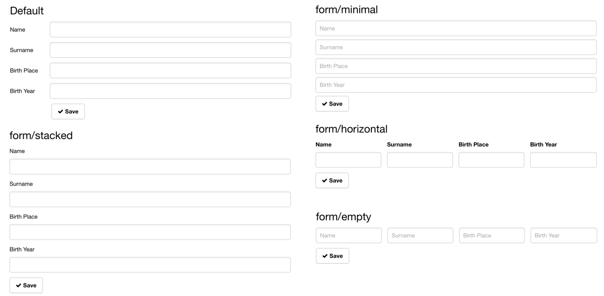

## Styling and Layout

Before you start going into the depths of customizing form layouts, you must remember one important thing: Agile Toolkit CSS uses "standard" layout elements in forms. (If you used Agile Toolkit 4.2 or earlier you will have to forget about those special form classes)

Depending how much you want to do with a form, there are different recommended ways:

 - Add any view inside a form, then insert fields inside that view. Great for basic multi-column forms or if you want to use boxes and wrappers.
 - Change the field flow of the form - stacked, minimal, horizontal forms. For the situations when you want to change presentation of individual field.
 - Arrange fields and their labels manually yourself. If you want to have credit card input appearing side-by-side.

### Adding Views inside Form

A form works and operates like any other View element. It has a template and you can add other views inside it. Any view which appears to be a child of a Form will have a new method - `addField()`. Calling this field have exactly same format as `form->addfield()`.

Next example will create 2 columns inside your form and then insert fields into those columns. It also uses "form/stacked" template so that labels appear above the fields.

    $form = $this->add('Form', null, null, ['form/stacked']);
    $c = $form->add('Columns');
    $c1 = $c->addColumn(6);
    $c1->addField('name');
    $c1->addField('surname');

    $c2 = $c->addColumn(6);
    $c2->addField('Text','address');

    $form->addSubmit('Save');

If you are using default form template, it relies on `
` surrounding fields. Be sure to add this class to your columns. 

You don't have to add all your fields inside views, but you can rather use fields as necessary. The next form uses columns only to arrange Birth Place and Birth Year side-by-side. The rest of fields use a normal flow. It also uses form/minimal template to hide labels and rely on placeholders instead.

    $form = $this->add('Form', null, null, ['form/minimal']);
    $form->addField('name');
    $form->addField('surname');

    $c = $form->add('Columns');
    $c->addColumn(8)->addField('birth_place');
    $c->addColumn(4)->addField('birth_year');

    $form->addSubmit('Save');

To gain the full power of the views inside form, you can use your form with custom templates. I'll explain more inside the "setLayout" section further down in this documentation.

### Customizing Form Template

As you already know, there are few form templates you can use out of the box. You can set the template as 4th argument when you add form:

    $form = $this->add('Form', null, null, ['form/minimal']);
    
An alternatives to default (`form`) template are: `form/minimal`, `form/stacked` and `form/horizontal` and `form/empty`.

If you are going to build your own, you must understand the Agile Toolkit CSS layouts and be comfortable with using HTML and JADE. Create file inside your local `template/form/` folder and copy one of the existing form templates from `atk4/template/form`. Remove the parts of template which are not needed. If label is not present, form will automatically use placeholders for captions.

Remember that Form Template is there for rendering generic form with generic set of fields. If you know which fields you are going to display and need a specific layout for your set of fields, look for "setLayout"

### setLayout

Let me go back to a custom template scenario I have mentioned earlier. Suppose you have your own template called `view/greeting_card.html`:

    My name is {$name} and surname is {$surname}.
    
When you add a view with this template inside a form, the fields with the matching names will be positioned exactly where the tags are. (Note: I've added atk-span-2 to fields because fields have 100% width by default)

    $form = $this->add('Form', null, null, ['form/empty']);

    $greeting_card = $form->add('View', null, null, ['view/greeting_card']);
    $greeting_card->addField('name')->addClass('atk-span-2');
    $greeting_card->addField('surname')->addCLass('atk-span-2');

    $form->addSubmit('Save');
    

Using this approach you can add several Views inside the form and assign different fields to them. In most cases, however, you would have one view for the full layout of the form. A simpler method to achieve that is to use `$form->setLayout()`. A single parameter to this method can be either a view or a template. This layout then will be used as a default way to output fields which are added into the form directly. Here is one way to do it:

    $form = $this->add('Form',null,null,['form/empty']);

    $greeting_card = $form->add('View', null, null, ['view/greeting_card']);
    $form->setLayout($greeting_card);
    $form->addField('name')->addClass('atk-span-2');
    $form->addField('surname')->addClass('atk-span-2');

    $form->addSubmit('Save');

Alternatively, you can just specify name of the template, and the view will be added automatically.

    $form = $this->add('Form', null, null, ['form/empty']);

    $form->setLayout('view/greeting_card');
    $form->addField('name')->addClass('atk-span-2');
    $form->addField('surname')->addCLass('atk-span-2');

    $form->addSubmit('Save');

Be sure to always add `{$Content}` tag to your form template. It will be used by all the fields which did not have their spot marked with a dedicated tag. Also - even though you are using layout, always specify a proper template, it will affect the appearance of the button and the fields which lack dedicated tag.

If you are using default form template, it relies on `
` surrounding fields, otherwise fields will not be aligned. 

### Use with Models

Form in Agile Toolkit automatically populates fields from the model, when you call `setModel()`. This means - you might not have a chance to arrange those fields into the appropriate views.

There are two ways around it.

First - you could use `setLayout()` before calling `setModel()`, then new fields will automatically go into the layout where necessary.

The other option is:

    $form->setModel('Book',false);  // prevents from any fields being imported
    
    $v = $form->add('MyView');
    $v->addField('title');          // will use the field from the model.
    
