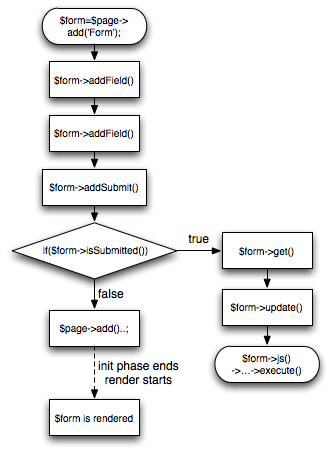

## WARNING

**Form implementation in Agile Toolkit may change. Do not rely on internal structure of the form, they are explained here for to help you understand how form actually works.**

### Form workflow
A sample work-flow of a form is explained in the diagram on the right. Like all other objects, form is added to your page or anywhere else during init phase. At that moment, form is not yet producing any output nor will it try to load any input. It is just being configured.

If you do not call `$form->isSubmitted();` then a default form::submitted() method will be called automatically if form was submitted by a user. An alternative to isSubmitted() method is calling `onSubmit()` which is used to set form's submission handler.

### Form Rendering
Upon initialization form will clone several templates from it's main template. Those templates are then manipulated to create contents of the form. For example, fields are inserted into tag `"Content"` of the form, but they are using "form_line" template. If form layout is used, the form_line is not used and fields are inserted directly into the template.

### Loadig Data
If you specify `setSource()` for the form along with ID, then method `loadData()` will be called before init and render phases which will load default data into the form. If you are using MVCForm, then the data is loaded when you call `loadData()` method. If you are executing `isSubmitted()` inside `init()`, then this will automatically `loadData()` before form submission is handled.

### Error handling
Form relies on fields to perform their validation. Form will execute `validate()` method for all it's children.