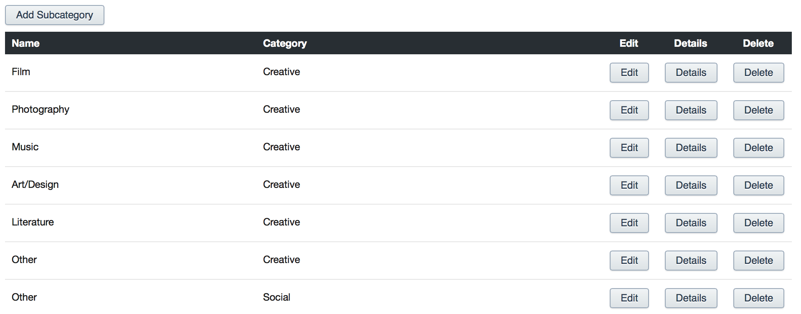
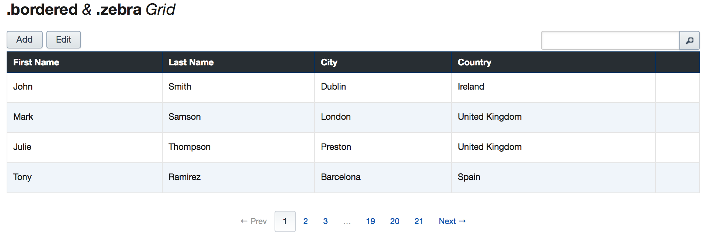

# User Interface > Lister, Menu and Grid
----

##Lister Overview
----

Object for displaying simple lists of items. Lister is commonly used with model to list all matching entries by using your own template.

### USE OF LISTER

Lister probably is one of the fundamental and simplest objects in Agile Toolkit. It lays foundation to a more sophisticated classes such as CompleteLister , Grid and therefore contributes towards CRUDs and other objects.

    $page->add('Lister')
      ->setSource(array('One','Two','Three'));
You must strongly consider using setModel before using any other source type.

### USE WITH MODEL
    $page->add('Lister')
      ->setModel('User');
Lister will automatically check what keys you've got in the template and will automatically configure your model to select those fields (actual fields) to speed up calculation.

#### USING WITH ASSOCIATIVE ARRAYS
    $page->add('Lister')
        ->setSource(array(
            5=>'John',
            7=>'Steve'
    ));
The key becomes the value for "id" field and value becomes "name"

#### USING WITH ARRAY OF HASHES
    $page->add('Lister')
        ->setSource(array(
          array('id'=>5,'name'=>'John'),
          array('id'=>7,'name'=>'Steve'),
    ));
Natuarlly you are not limited only to those fields. You may specify any set of fields.

#### USING WITH ITERATOR
    $page->add('Lister')
        ->setSource(new DirectoryIterator('.'));
Any iterator may be used. If iterator returns array, it will be populated into the fields. Otherwise you need to redefine `formatRow()` function and read `$this->current_row` value which was returned from the iterator.

### COMPLETELISTER

CompleteLister class extends the functionality of default lister by allowing it to have a more comprehensive template. If default Lister will repeat it's own template as many times as necessary, CompleteLister will look for tag "row" cache it and will render it into "rows" tag after emptying it's contents. Here is a sample template for CompleteLister:

    <?MyLister?>
    <ul>
      <?rows?>
      <?row?>
        <li><?name?>John Smith<?/?></li>
      <?/?>
        <li>Peter Oink</li>
        <li>Steven Jobs</li>
      <?/rows?>
    </ul>
    <?/MyLister?>
With this template, it's possible to preserve the existing HTML too. CompleteLister will clone template inside "row" and then delete contents of "rows" region, therefore Peter and Steven entries will be simply deleted. John's entry will be re-used but the "name" tag will be populated from the model.

In terms of data sources, CompleteLister can use all the same sources as Lister does.

It might be a good idea for you to extend CompleteLister into your own classes such as "ClientLister" or "OrderLister" which will perform necessary formatting or other tweaks. CompleteLister is also a view therefore you can add tags around "rows" tags and set them explicitly.

##Menu Overview
----

TODO

##Grid Overview
----

This document is a tutorial for a basic use of Grid.

What is Grid?
----

Grid is a visual element in Agile Toolkit which is designed for presenting multi-column data. Relying on a basic HTML TABLE markup, the main purpose of a grid is to give you a simple and usable way of presenting data to the user.

As you see more features and want to have a fancier display of data, you might find Grid un-suitable to accommodate your layout - look further into [Complete Lister](../lister/overview.md).

### What Grid can and cannot do
Grid always consists of columns. Usually one model's field per column. Grid is capable of sorting by column as well as letting you format columns. 

Grid relies on a HTML TABLE and flexibly adjusts itself to full width of HTML container. Grid does not rely on JavaScript for presenting itself. While there are some enhancements which allow you to edit data directly inside Grid, it's not a primary purpose of a Grid. Grid is designed to display one-dimensional data, it does not support tree-structure, however you can use "Expander" to contain Grid inside another Grid.

#### Zebra Grid
For a slight polish on a Grid's look and feel, you can add class "zebra" to your grid. This will produce a slightly different look:

### Implementation
Grid extends CompleteLister View, which gives Grid the ability to repeat a certain portion of HTML continuously. When grid is being rendered, it first prepares it's "row" template. This ultimately impacts how all those rows will look. The contend of a rows template is determined by the list of columns you are willing to display on the grid.

Furthermore Grid iterates through it's data source and stores values of each row inside `current_row` property then by calling `formatRow` and `format_<datatype>` on each column data, it converts values inside HTML presentation inside `current_row_html`. The resulting set of data is inserted into our row template to be rendered once again and appended to the body of the table. You can still access `$this->model` although this object will not be defined when Grid is used without model.

As a result, several behaviors are observed:

 - Values placed for current row but missing from within the next row will keep appearing inside row template. You should must make at least pass NULL as a value of a `current_row` hash, to clear out previous values.
 - Unless you specifically want to output safe HTML, you should store your value inside `current_row` property - this property is automatically escaped when the row is rendered.
 - Avoid [Row-based Sub-Selects](../performance.md) when you render and try not to traverse model fields.
 
 Features
 ---
 Grid implementation is split into 2 classes: Grid_Basic and Grid_Advanced. The basic portion implements all the core functionalities of the grid, while Advanced adds more formatters and integrations with other views and extensions. You should always use `Grid` class which inherits `Grid_Advanced` unless you really know what you are doing.
 
 - Grid automatically selects all `visible` fields of the model. 
 - When using `setModel()` you can override list of field and order in which they are displayed.
 - Automatically assigns appropriate formatters for your fields.
 - `addPaginator` integrates `Paginator` which breaks results into pages with defined number of rows.
 - `addQuicksearch` adds `QuickSerarch` form in the corner for filtering result by one of the specified columns or using model's custom `like()` function.
 - Allows you to use custom `Iterator` with `setModel` but you would need to call `addColumn` manually.
 - `addFormatter` can use multiple formatters per field, e.g. "money" and "nowrap".
 - Scalable: grid does not create object or perform queries on every row.
 - automatically keeps up `totals` which can be appended as yet another row at the bottom of grid.
 - `sortable` grids automatically get sorting control.
 - `addButton` is a wrapper for adding buttons into button set on top of grid.
 - handles situations with no records.
 - Change TD-styling with `setTDParam`.
 - Support for Column add-ons.
 - integrates with `selectable` and `ui.atk4_checkboxes` with `addSelectable`.
 
 
Obviously Grid inherits all the features of the View as well as you can manipulate `$grid->model` in any way model can be manipulated making it possible to change styling, positioning, size and rendering of a grid, conditions, order or other properties of a select query.

### How to create and use Formatters?
While most situations can be solved with generic grid, it does need to display data in a reasonable formats. But how does Grid determine a type of your column?

#### Field `type()`
Model's field `type()` method can be used to specify the type of the column. There are defined set of supported types, and the primary purpose of this setting is to define how data is stored.

When you call `grid->setModel` it creates a new object - `Controller_MVCGrid` which is responsible for populating columns inside Grid and also matches data-types into grid column types. For example `list`, `int` type is displayed as `text`, `money` uses formatter also named `money` and `text` is displayed using `shorttext` formatter, which shows just a fragment of your long text fields.

If you want to implement your own type and it's associations, look into [Creating your own Grid Controller](TODO)

#### Field `display()`
Allows you to specify formatter exactly. Does not affect the behavior of the model. Can either target all views with `type('password')` or only grid with `type(array('grid'=>'password'))`. 

You can specify a display type either inside your model definition or inside presentation logic, like this:

    $m=$this->add('Model_Book');
    $m->getElement('author')->display('link');
    $this->add('Grid')->setModel($m);
    
#### addColumn()
This method adds new column to your grid. Even if you are using Model, you can still add few extra columns and use custom formatters.

Formatter needs to be defined as a method of a grid.
    
    class MyGrid extends Grid {
        function format_smiley($field) {
            $this->current_row[$field] = 
                str_replace(':)','☺',$this->current_row[$field]);
        }
    }
    $grid=$this->add('MyGrid');
    $grid->addColumn('smiley','my field');